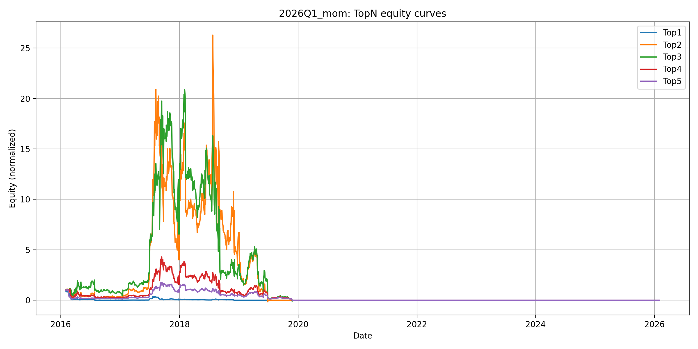

# Quant ML MVP

A-share momentum research platform using SQLite bars and reproducible, project-scoped experiments.

## Quickstart
1. Build and freeze universe, then update bars:
   - `python scripts/steps/10_symbols.py --project 2026Q1_mom`
   - `python scripts/steps/11_update_bars.py --project 2026Q1_mom --mode incremental`
2. Build rank and candidate stats:
   - `python scripts/steps/20_build_rank.py --project 2026Q1_mom`
3. Backtest and generate report:
   - `python scripts/steps/30_bt_rebalance.py --project 2026Q1_mom --no-show --save auto`
   - `python scripts/audit_db.py --project 2026Q1_mom`
   - `python scripts/steps/40_make_report.py --project 2026Q1_mom`

## Results

Sample output:

Main artifacts:
- `artifacts/projects/2026Q1_mom/topn_1_5.png`
- `artifacts/projects/2026Q1_mom/summary_metrics.csv`
- `artifacts/projects/2026Q1_mom/report.md`

## Reproducibility

Each run is reproducible through:
- project config: `configs/projects/2026Q1_mom.json`
- frozen universe: `data/projects/2026Q1_mom/meta/universe_codes.txt`
- run manifest: `data/projects/2026Q1_mom/meta/run_manifest.json`
- generated reports and metrics under `artifacts/projects/2026Q1_mom/`

## Repository Structure

- `src/quant_mvp/`: shared config, universe, manifest, ranking, backtest, reporting utilities
- `scripts/steps/`: pipeline stages
- `scripts/audit_db.py`: database coverage audit
- `configs/projects/`: project configs
- `docs/projects/`: methodology and experiment notes
- `docs/factors.md`: factor library definitions
- `tests/`: unit and smoke tests

## Unified CLI

Run any task with one entrypoint:
- `python -m quant_mvp run --project 2026Q1_mom --task rank`
- `python -m quant_mvp run --project 2026Q1_mom --task backtest -- --no-show --save auto`

## Recent Fixes

- 2026-02-08: fixed AkShare Chinese-column compatibility in:
  - `scripts/steps/11_update_bars.py` (`_fetch_akshare_daily`)
  - `scripts/steps/10_symbols.py` (`build_symbols`, `_is_st`)
- Added offline regression tests in `tests/test_akshare_column_mapping.py`.
- Validation command:
  - `py -3.14 -m pytest -q`
