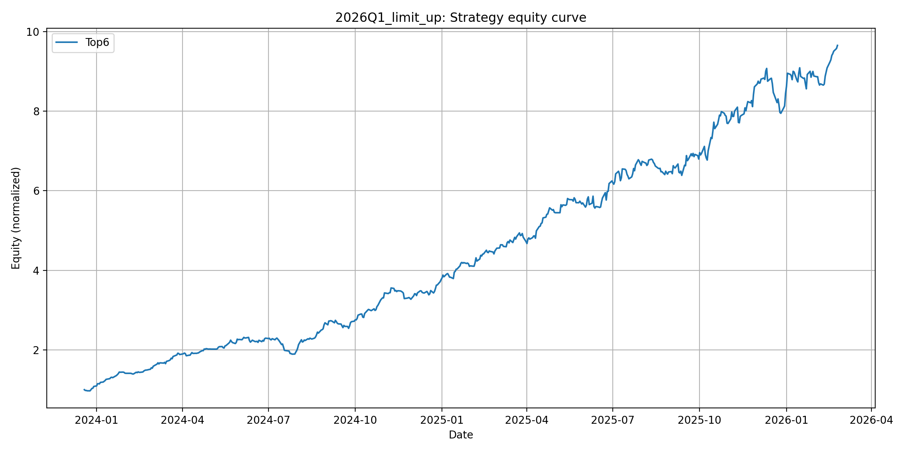
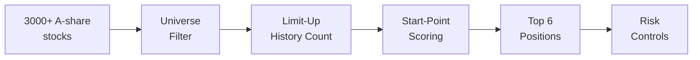
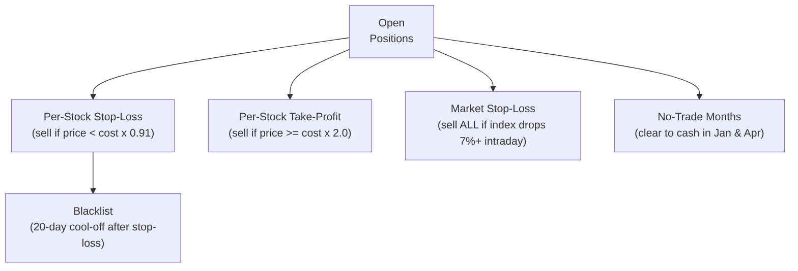
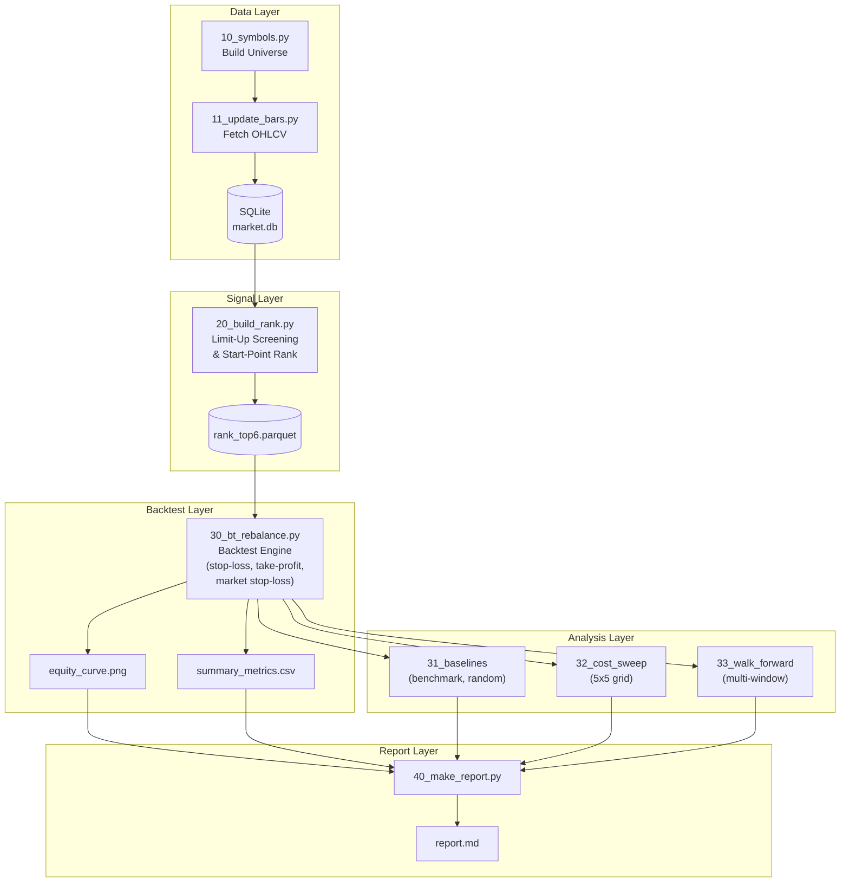

<p align="center">
  <h1 align="center">MyQuantJournal</h1>
  <p align="center">
    A reproducible China A-share quantitative research platform<br/>
    featuring an original <strong>Limit-Up Screening</strong> strategy
  </p>
</p>

<p align="center">
  
  
  
  
</p>

---

## What This Project Does

This project builds a **complete quantitative trading research pipeline from scratch** -- from raw market data all the way to backtested results and automated reports. The core idea is an original stock-selection strategy called **Limit-Up Screening**: it finds A-share stocks with frequent historical price limit-up events, enters positions near their breakout origin, and manages risk through multiple protective layers.

Everything is written in Python with no proprietary dependencies. All data, parameters, and results are versioned and reproducible.

---

## Key Results at a Glance

> Backtest window: **2023-01-03 to 2026-02-27** | Initial capital: **CNY 1,000,000** | 6 equal-weight positions | Tuesday rebalance

| Metric | Value |
|--------|-------|
| **Total Return** | +865.4% |
| **Annualized Return** | +172.0% |
| **Sharpe Ratio** | 6.69 |
| **Max Drawdown** | -18.2% |
| **Annualized Volatility** | 25.3% |
| **Final Equity** | CNY 9,654,322 |
| **Trading Days** | 571 |

### Equity Curve

The normalized equity curve shows how the portfolio value evolved over the backtest period:



### Drawdown from Peak

This chart shows every peak-to-trough drawdown. The worst drawdown was -18.2%, demonstrating the effectiveness of the multi-layer risk controls:


> *Charts are auto-generated by the pipeline. Run the backtest to reproduce them (see [Quickstart](#quickstart)).*

---

## How the Strategy Works

The strategy runs a **4-step pipeline** every Tuesday:



### Step 1: Universe Filter

Remove stocks that are too risky or illiquid:

| Rule | What it removes |
|------|-----------------|
| STAR Market (688/689) | High-volatility tech board |
| ChiNext (300/301) | Growth-stage small caps |
| BSE (4xx/8xx) | Beijing Stock Exchange |
| ST / delisting risk | Financially troubled stocks |
| IPO < 1 year | Insufficient price history |
| Limit-locked on rebalance day | Untradeable stocks |

### Step 2: Limit-Up History Count

For each remaining stock, count how many days in the past **250 trading days** (~1 year) the daily return reached **+9.5%** or higher (a proxy for price limit-up). Keep only the **top 10%** by count.

### Step 3: Start-Point Scoring

For each candidate:
1. Find the **most recent limit-up day**.
2. Scan backward to find the first **bearish candle** (close < open) -- this is the "breakout origin".
3. Score = `current_price / origin_price`. **Lower score = closer to the breakout origin = more attractive.**

### Step 4: Risk Controls

Once positions are opened, five protective mechanisms run daily:



| Control | Trigger | Action |
|---------|---------|--------|
| **Stop-loss** | price < cost x 0.91 | Sell position |
| **Take-profit** | price >= cost x 2.0 | Sell position |
| **Market stop-loss** | Index close/open <= 0.93 | Liquidate everything |
| **No-trade months** | January, April | Clear to cash at month end |
| **Blacklist** | After any stop-loss | Don't re-buy for 20 days |

---

## Pipeline Architecture

The entire system is a sequence of independent, composable steps:



Each step reads from disk and writes to disk -- no hidden state. You can re-run any single step without touching the others.

---

## Quickstart

### Prerequisites

- Python 3.10+
- Install dependencies:

```bash
pip install -r requirements.txt
```

### Run the Full Pipeline

```bash
# Step-by-step
python scripts/steps/10_symbols.py          # Build universe
python scripts/steps/11_update_bars.py --mode incremental  # Fetch market data
python scripts/steps/20_build_rank.py        # Build limit-up screening rank
python scripts/steps/30_bt_rebalance.py --no-show --save auto  # Run backtest
python scripts/audit_db.py                   # Audit data coverage
python scripts/steps/40_make_report.py       # Generate report

# Or all-in-one
python scripts/run_limit_up_screening.py --no-show --save auto
```

### Run a 5-Year Backtest

A dedicated config is provided for a **2020--2025** backtest window:

```bash
python scripts/run_limit_up_screening.py \
  --config configs/projects/2026Q1_limit_up_5y.json \
  --no-show --save auto
```

### Unified CLI

```bash
python -m quant_mvp run --project 2026Q1_limit_up --task backtest -- --no-show --save auto
python -m quant_mvp run --project 2026Q1_limit_up --task report
```

Available tasks: `universe`, `update`, `rank`, `backtest`, `strategy`, `baselines`, `cost`, `walk_forward`, `audit`, `report`, `factors`.

---

## Evaluation Metrics

The backtest engine computes a comprehensive set of quantitative performance metrics:

| Metric | Definition | Why It Matters |
|--------|-----------|----------------|
| **Total Return** | (final equity / initial equity) - 1 | Raw cumulative gain |
| **Annualized Return** | Geometric annualization at 252 days/year | Comparable across different time windows |
| **Annualized Volatility** | Daily return std x sqrt(252) | Measures risk / price fluctuation |
| **Max Drawdown** | Largest peak-to-trough decline | Worst-case scenario for an investor |
| **Max Drawdown Duration** | Days spent in the worst drawdown | How long recovery takes |
| **Sharpe Ratio** | (ann. return - risk-free) / ann. volatility | Risk-adjusted return (higher = better) |
| **Sortino Ratio** | (ann. return - risk-free) / downside deviation | Sharpe variant penalizing only downside risk |
| **Calmar Ratio** | ann. return / abs(max drawdown) | Return per unit of worst-case risk |
| **Win Rate** | Fraction of days with positive return | Daily directional accuracy |
| **Return Skewness** | Skewness of daily return distribution | Positive = more large gains than large losses |

---

## Strategy Parameters

| Parameter | Default | Description |
|-----------|---------|-------------|
| `stock_num` | 6 | Number of equal-weight positions |
| `rebalance_weekday` | 1 (Tue) | Weekly rebalance day |
| `limit_days_window` | 250 | Trailing window for limit-up counting |
| `top_pct_limit_up` | 0.10 | Keep top 10% by limit-up count |
| `limit_up_threshold` | 0.095 | Daily return threshold for limit-up proxy |
| `init_pool_size` | 1000 | Pre-filter pool size |
| `stoploss_limit` | 0.91 | Stop-loss trigger (price / cost) |
| `take_profit_ratio` | 2.0 | Take-profit trigger (price / cost) |
| `market_stoploss_ratio` | 0.93 | Market-wide stop-loss threshold |
| `loss_black_days` | 20 | Blacklist duration after stop-loss |
| `no_trade_months` | [1, 4] | January & April (seasonal risk) |
| `commission` | 0.0001 | Commission rate per side |
| `stamp_duty` | 0.0005 | Stamp duty on sells |
| `slippage` | 0.002 | Slippage cost per trade |
| `min_commission` | 5.0 | Minimum commission (CNY) |
| `cash` | 1,000,000 | Initial capital (CNY) |

All parameters live in a single JSON config: `configs/projects/2026Q1_limit_up.json`.

---

## Repository Structure

```
MyQuantJournal/
├── quant_mvp/                 Core library
│   ├── selection.py           Limit-up screening logic
│   ├── backtest_engine.py     Backtest engines + metrics
│   ├── ranking.py             Rank construction
│   ├── reporting.py           Auto-report generation
│   ├── config.py              Config loading & defaults
│   ├── db.py                  SQLite OHLCV storage
│   ├── universe.py            Universe load/save
│   ├── manifest.py            Run manifest tracking
│   ├── factors.py             Factor library (6 factors)
│   ├── cli.py                 Unified CLI router
│   └── project.py             Project path resolution
├── scripts/
│   ├── run_limit_up_screening.py   All-in-one strategy script
│   └── steps/                      Modular pipeline steps (10-40)
├── configs/projects/               JSON configs per experiment
├── data/                           SQLite DB + project metadata
├── artifacts/                      Charts, metrics, reports
├── docs/                           Strategy spec, decisions log
├── dashboard/app.py                Streamlit dashboard
├── tests/                          Unit & smoke tests
├── requirements.txt
└── pyproject.toml
```

---

## Reproducibility

Every experiment is pinned to three artifacts that make it fully reproducible:

| What | Where | Purpose |
|------|-------|---------|
| **Config** | `configs/projects/<project>.json` | All strategy parameters |
| **Frozen universe** | `data/projects/<project>/meta/universe_codes.txt` | Exact stock list |
| **Run manifest** | `data/projects/<project>/meta/run_manifest.json` | Git commit, timestamp, paths, stats |

The run manifest records the exact git commit hash, so you can always trace results back to the code that produced them.

---

## Design Philosophy

| Principle | Implementation |
|-----------|---------------|
| **Reproducibility first** | Every run is pinned to a frozen universe, JSON config, and manifest with git commit hash |
| **Local-first data** | All market data in a single SQLite file; no cloud dependency at runtime |
| **Modular pipeline** | Independent steps (universe, data, rank, backtest, report) that compose via files |
| **Strategy as code** | Selection logic, backtest engine, and risk controls are all in testable Python modules |

---

## Development

```bash
python -m pytest tests/ -v           # Run tests
python scripts/audit_db.py           # Audit data coverage
streamlit run dashboard/app.py       # Interactive dashboard
```

- Pre-commit hooks: `.pre-commit-config.yaml`
- CI: `.github/workflows/ci.yml`

---

## Roadmap

- [ ] Market capitalization data for small-cap filtering
- [ ] Shenwan L2 industry classification for cross-industry diversification
- [ ] Defense asset rotation (ETFs) during no-trade months
- [ ] Turnover monitoring and volume-based exit signals
- [ ] Multi-factor composite scoring (limit-up + momentum + volatility)
- [ ] Live/paper trading integration

---

## License & Disclaimer

This project is for **research and educational purposes only**. It is not financial advice and should not be used for actual trading without proper validation and risk management. Past backtest performance does not guarantee future results.
